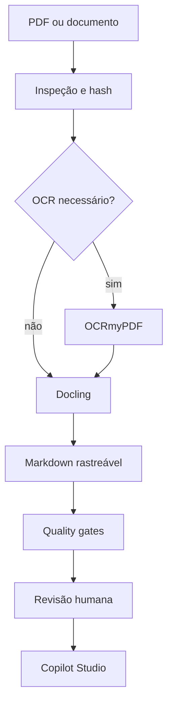

# Copilot Document Knowledge Engineering

[](https://github.com/viniciusds2020/copilot-document-knowledge-engineering/actions/workflows/ci.yml)
[](https://www.python.org/)
[](LICENSE)

Este projeto transforma documentos corporativos em conhecimento rastreável e governado para agentes do **Microsoft Copilot Studio**. O pipeline inspeciona PDFs, decide quando aplicar OCR, converte o conteúdo para Markdown, executa quality gates e entrega artefatos de instruções, prompts e avaliação.

## O que a solução entrega

- inspeção de PDFs e decisão automática de OCR por cobertura de texto;
- OCR opcional com OCRmyPDF e conversão estruturada com Docling;
- fallback leve com PyMuPDF para desenvolvimento e testes;
- Markdown com metadados, hash, origem e marcadores de página;
- workflow `draft → review → approved/deprecated`;
- API FastAPI e interface HTML para upload, revisão e aprovação;
- instruções, prompt com fontes, política de segurança e skill reutilizável;
- dataset dourado e avaliação determinística de respostas.

## Arquitetura



## Execução rápida

```bash
python -m venv .venv
source .venv/bin/activate
pip install -e ".[dev]"
uvicorn knowledge_engineering.api:app --reload
```

Acesse `http://localhost:8000`. O modo padrão `fallback` funciona sem Docling, Tesseract ou Ghostscript. Para o pipeline completo:

```bash
pip install -e ".[document,dev]"
export KE_CONVERTER=docling
```

O OCRmyPDF também requer Tesseract e Ghostscript no sistema. Em Docker, essas dependências já são instaladas:

```bash
docker compose up --build
```

## API

| Método | Rota | Finalidade |
|---|---|---|
| `POST` | `/api/documents` | Upload e processamento |
| `GET` | `/api/documents` | Catálogo e métricas |
| `GET` | `/api/documents/{id}` | Documento e Markdown |
| `PATCH` | `/api/documents/{id}/status` | Revisar, aprovar ou depreciar |
| `GET` | `/api/health` | Saúde e modo ativo |

## Integração com Copilot Studio

1. Aprove apenas conteúdo que passou pelos quality gates e revisão humana.
2. Publique o Markdown aprovado em uma fonte de conhecimento suportada.
3. Copie `copilot/agent/global_instructions.md` para as instruções do agente.
4. Use `copilot/prompts/answer_with_sources.md` em um tópico de resposta generativa.
5. Teste com `copilot/evaluation/golden_dataset.json` antes da promoção.
6. Marque uma fonte como oficial somente depois da validação de conteúdo e permissões.

## Segurança e governança

- uploads recebem nome interno e nunca são servidos diretamente;
- extensão, tamanho e assinatura PDF são validados;
- documentos duplicados são detectados por SHA-256;
- aprovação exige quality gate aprovado;
- instruções proíbem invenção de fontes e vazamento de conteúdo;
- arquivos em `data/` são ignorados pelo Git e devem usar armazenamento seguro em produção.

## Estrutura

```text
src/knowledge_engineering/  API, pipeline, persistência e interface
copilot/                    instruções, prompts e avaliação
skills/document-curator/    skill e contratos de entrada/saída
configs/                    parâmetros do pipeline
tests/                      testes unitários e de integração
```

## Referências

- [Docling](https://docling-project.github.io/docling/)
- [OCRmyPDF](https://ocrmypdf.readthedocs.io/)
- [Fontes de conhecimento no Copilot Studio](https://learn.microsoft.com/en-us/microsoft-copilot-studio/knowledge-copilot-studio)
- [Testar fontes de conhecimento](https://learn.microsoft.com/en-us/microsoft-copilot-studio/knowledge-test)

## Roadmap

- armazenamento de objetos e PostgreSQL;
- autenticação corporativa e RBAC;
- publicação automatizada em SharePoint/Dataverse;
- observabilidade, filas e processamento assíncrono;
- avaliação semântica e detecção de regressão por versão.

## Licença

MIT.

