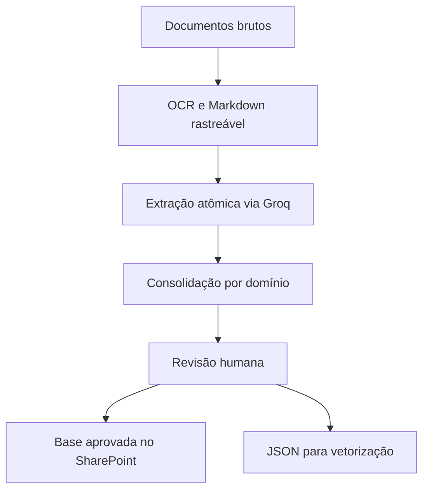

# Copilot Document Knowledge Engineering

[](https://github.com/viniciusds2020/copilot-document-knowledge-engineering/actions/workflows/ci.yml)
[](https://www.python.org/)
[](LICENSE)

Pipeline governado para transformar documentos corporativos em conhecimento rastreável para agentes do Microsoft Copilot Studio. A versão 0.2 inclui a curadoria e consolidação semântica via Groq, mantendo cada regra vinculada ao documento, hash e página de evidência.

## O que a solução entrega

- inspeção de PDFs e decisão automática de OCR por cobertura de texto;
- OCR opcional com OCRmyPDF e conversão estruturada com Docling;
- fallback leve com PyMuPDF para desenvolvimento e testes;
- Markdown com metadados, hash, origem e marcadores de página;
- workflow `draft → review → approved/deprecated`;
- geração de pacotes de conhecimento consolidados com Groq;
- JSON estruturado e Markdown pronto para publicação no SharePoint/Copilot Studio;
- detecção de documentos duplicados por SHA-256;
- dataset dourado e avaliação determinística de respostas.

## Fluxo de conhecimento consolidado


```mermaid
flowchart TD
    A[Documentos brutos] --> B[OCR e Markdown rastreável]
    B --> C[Extração atômica via Groq]
    C --> D[Consolidação por domínio]
    D --> E[Revisão humana]
    E --> F[Base aprovada no SharePoint]
    E --> G[JSON para vetorização]
```

O LLM não substitui a fonte oficial: cada item consolidado preserva o identificador do documento, título, hash e página de evidência. Documentos ainda não aprovados não podem entrar em um pacote.

## Execução rápida

```bash
python -m venv .venv
source .venv/bin/activate
pip install -e ".[dev]"
cp .env.example .env
uvicorn knowledge_engineering.api:app --reload
```

O modo padrão `fallback` funciona sem Docling, Tesseract ou Ghostscript. Para o pipeline completo:

```bash
pip install -e ".[document,dev]"
export KE_CONVERTER=docling
```

O OCRmyPDF também requer Tesseract e Ghostscript no sistema. Em Docker, essas dependências já são instaladas:

```bash
docker compose up --build
```

## Configurando o Groq

Defina a chave localmente, sem incluí-la no Git:

```bash
export KE_GROQ_API_KEY="sua-chave"
export KE_GROQ_MODEL="seu-modelo-groq"
```

O projeto envia apenas o Markdown de documentos aprovados e limita cada fonte a `KE_MAX_SOURCE_CHARS_PER_DOCUMENT` (20.000 por padrão). Isso controla o custo de ingestão. A geração é incremental por documento: o hash impede reprocessar conteúdo idêntico.

## API

| Método | Rota | Finalidade |
|---|---|---|
| `POST` | `/api/documents` | Upload e processamento |
| `GET` | `/api/documents` | Catálogo de documentos |
| `PATCH` | `/api/documents/{id}/status` | Revisar, aprovar ou depreciar |
| `POST` | `/api/knowledge-packs` | Consolida documentos aprovados usando Groq |
| `GET` | `/api/knowledge-packs` | Lista pacotes consolidados |
| `GET` | `/api/knowledge-packs/{id}` | Retorna Markdown e JSON rastreáveis |
| `GET` | `/api/health` | Saúde, conversor e configuração Groq |

Exemplo de criação de pacote:

```json
{
  "document_ids": ["a1b2c3d4e5f6", "a7b8c9d0e1f2"],
  "domain": "PVC Fase 9",
  "version": "2026.1"
}
```

## Integração com Copilot Studio

1. Aprove apenas conteúdo que passou pelos quality gates e pela revisão humana.
2. Publique o Markdown aprovado em uma biblioteca SharePoint segregada por domínio.
3. Conecte o agente uma vez à pasta aprovada do domínio.
4. Copie `copilot/agent/global_instructions.md` para as instruções do agente.
5. Use `copilot/prompts/answer_with_sources.md` em um tópico de resposta generativa.
6. Teste com `copilot/evaluation/golden_dataset.json` antes da promoção.

## Vetorização futura

Mantenha duas coleções:

- `raw_chunks`: trechos do Markdown original, com hash e página;
- `curated_chunks`: regras e FAQs consolidadas pelo Groq, também com as mesmas evidências.

Assim o chatbot responde rapidamente com conhecimento curado e ainda recupera a fonte original em casos de auditoria, conflito ou detalhamento.

## Segurança e governança

- uploads recebem nome interno e nunca são servidos diretamente;
- extensão, tamanho e assinatura PDF são validados;
- documentos duplicados são detectados por SHA-256;
- aprovação exige quality gate aprovado;
- pacotes só aceitam documentos aprovados;
- instruções proíbem invenção de fontes e vazamento de conteúdo;
- arquivos em `data/` são ignorados pelo Git e devem usar armazenamento seguro em produção.

## Roadmap

- publicação automatizada no SharePoint via Graph API ou Power Automate;
- processamento em lote e atualização incremental por domínio;
- extração de versão, vigência, confidencialidade e proprietário;
- autenticação corporativa e RBAC;
- filas, observabilidade e avaliação de regressão.

## Licença

MIT.
